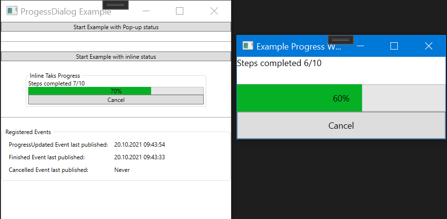

# ProgressDialog
Simple, easy to use dialog with ProgressBar for WPF with the MVVM pattern, that can either be embedded into an existing window or be displayed as a dialog in it's own window.

The package consists of two parts:
* The user interface side, either as standalone `ProgressDialogWindow`, or as `ProgressDialogUserControl` to be embedded into an existing window. 
* A `ProgressStatus` object implementing the `IProgressStatus` interface. The `ProgressStatus` object can be passed to the model and any long running task can use it to update the status in the view, receive a cancellation request etc. The `ProgressStatus` object is also passed as the `DataContext` to the `ProgressDialogUserControl`, so the view can bind to it's properties in a clean MVVM-fashion.

## How to use

Simply add the nuget package https://www.nuget.org/packages/ProgressDialog/ project as dependency.
If you want to integrate the `ProgressStatus` object into a model in e.g. a netStandard library without support for WPF, use this package in the model: https://www.nuget.org/packages/ProgressDialogStatus/. It provides the `ProgressStatus` class - and the `IProgressStatus` interface, in case you want to implement it yourself - seperately from the WPF components. 

## Example
https://github.com/ax-meyer/ProgressDialog/tree/master/ProgressDialog/ProgressDialogExample provides a sample view model showing the usage of the ProgressDialog.

The dialog itself is just a plain, standard WPF dialog per default:

Since it just uses standard components (button, progress bar etc.) you can adapt the style however you like.
